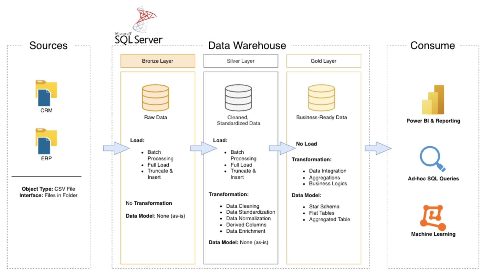

# 🏗️ Data Warehouse & Analytics Project

**An end-to-end SQL Server ETL pipeline built on the Medallion Architecture — turning raw CRM and ERP exports into analytics-ready data.**


> A portfolio project showing how raw, messy operational exports become a clean, trustworthy foundation for business reporting — built entirely on SQL Server, Docker, and T-SQL.

## Table of Contents
- [Data Architecture](#data-architecture)
- [Highlights](#highlights)
- [Tech Stack](#tech-stack)
- [Project Requirements](#project-requirements)
- [Repository Structure](#repository-structure)
- [Getting Started](#getting-started)
- [License](#license)
- [About Me](#about-me)

---

## Data Architecture



The project follows the **Medallion Architecture**, moving data through three progressively cleaner layers:

| Layer | Purpose | Example |
|---|---|---|
| 🥉 **Bronze** | Raw data, ingested as-is from source CSVs | `bronze.crm_cust_info` |
| 🥈 **Silver** | Cleansed, standardized, and deduplicated | `silver.crm_cust_info` |
| 🥇 **Gold** | Business-ready star schema for reporting | fact & dimension views |

---

## Highlights

What the Silver-layer transformation logic actually does, beyond a simple copy-through:

- 🔁 **Idempotent, re-runnable loads** — every table follows a `TRUNCATE` + `INSERT` pattern inside a single `TRY/CATCH` block, so the whole Silver layer can be rebuilt from scratch at any time.
- 🛡️ **Defensive cleansing** — marital status, gender, and country codes are normalized to readable values with an explicit `'n/a'` fallback instead of a silent `NULL`; malformed or zero-value dates are caught and nulled rather than breaking the load.
- 🧮 **Self-correcting business logic** — sales figures are recalculated on the fly whenever the source `sales`, `quantity`, and `price` values don't reconcile with each other.
- 🪵 **Built-in observability** — every load step prints its own duration plus a final batch summary, so a slow or failed run is easy to spot from the output alone.

A sample of the cleansing logic — deduplicating and normalizing raw CRM customer records:

```sql
SELECT
    cst_id,
    cst_key,
    TRIM(cst_firstname) AS cst_firstname,
    CASE
        WHEN UPPER(TRIM(cst_marital_status)) = 'S' THEN 'Single'
        WHEN UPPER(TRIM(cst_marital_status)) = 'M' THEN 'Married'
        ELSE 'n/a'
    END AS cst_marital_status,
    ROW_NUMBER() OVER (PARTITION BY cst_id ORDER BY cst_create_date DESC) AS flag_last
FROM bronze.crm_cust_info
WHERE cst_id IS NOT NULL;
```

---

## Tech Stack

| Category | Tool |
|---|---|
| Database Engine | SQL Server 2022 (Docker) |
| IDE | Visual Studio Code + `mssql` extension |
| Containerization | Docker |
| Version Control | Git & GitHub |
| Diagramming | [draw.io](https://www.drawio.com/) |
| Project Template | [Notion](https://www.notion.com/templates/sql-data-warehouse-project) |

**Resources**
- 📂 [`datasets/`](datasets/) — raw ERP & CRM source files

---

## Project Requirements

### Building the Data Warehouse (Data Engineering)

**Objective:** develop a modern data warehouse in SQL Server that consolidates sales data from two source systems into a single, analysis-ready model.

**Specifications:**
- **Sources** — import CRM and ERP data, both delivered as CSV files.
- **Quality** — cleanse and resolve data quality issues before data reaches the Silver layer.
- **Integration** — merge both sources into one user-friendly model built for analytical queries.
- **Scope** — latest snapshot only; historical tracking (SCD) is out of scope.
- **Documentation** — clear data model docs for both business stakeholders and analytics teams.

### BI: Analytics & Reporting (Data Analysis)

**Objective:** deliver SQL-based analytics on customer behavior, product performance, and sales trends — giving stakeholders the metrics they need for strategic decisions.

See [docs/requirements.md](docs/requirements.md) for full detail.

---

## Repository Structure

```
data-warehouse-project/
│
├── datasets/                     # Raw ERP and CRM source files
│
├── docs/                         # Architecture diagrams and documentation
│   ├── data_architecture.drawio
│   ├── data_flow.drawio
│   ├── data_models.drawio
│   ├── data_catalog.md
│   ├── naming-conventions.md
│   └── etl.drawio
│
├── scripts/                      # SQL scripts for ETL and transformations
│   ├── bronze/                   # Raw data ingestion
│   ├── silver/                   # Cleansing and transformation
│   └── gold/                     # Analytical star schema
│
├── tests/                        # Data quality and validation scripts
│
├── README.md
├── LICENSE
├── .gitignore
└── requirements.txt
```

---

## Getting Started

1. **Clone the repository**
```bash
   git clone <your-repo-url>
   cd data-warehouse-project
```

2. **Spin up SQL Server in Docker**
```bash
   docker run -e "ACCEPT_EULA=Y" -e "MSSQL_SA_PASSWORD=<YourStrong!Passw0rd>" \
     -p 1433:1433 --name sql \
     -v "$(pwd)/datasets:/var/opt/mssql/data/datasets" \
     -d mcr.microsoft.com/mssql/server:2022-latest
```
   Use your own password, and keep real credentials out of the repo.

3. **Create the schemas and tables** by running the DDL scripts in `scripts/bronze/` and `scripts/silver/`.

4. **Load the data**
```sql
   EXEC bronze.load_bronze;
   EXEC silver.load_silver;
```

5. **Query the Gold layer** for reporting-ready views once it's built out.

---

## License

This project is licensed under the [MIT License](LICENSE) — free to use, modify, and share with attribution.

---

## About Me

Hi, I'm **Jansen Capili** — a Business Intelligence Analyst.

[](http://linkedin.com/in/gerryjansencapili)

---

⭐ If this project was useful or interesting, consider giving it a star!
